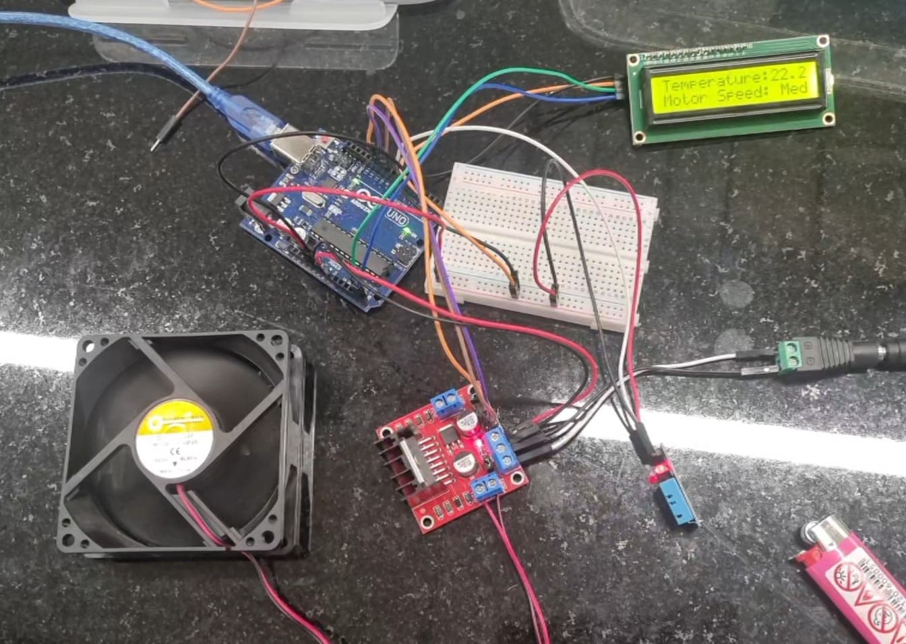

# Temperature Controlled Fan using Arduino

This project demonstrates a temperature-based fan control system using an Arduino Uno. The system reads ambient temperature via a DHT11 sensor and adjusts the speed of a 12V exhaust fan accordingly using an L298N motor driver module. Real-time temperature and fan status are displayed on an LCD screen with an I2C interface

## Components Used
- Arduino Uno	
- L298N Motor Driver
- DHT11 Temperature Sensor
- 16x2 LCD with I2C Module	
- Female DC Connector	
- 12V Adapter	
- 12V Exhaust Fan	

## Circuit Connections

### DHT11 Sensor:
      - VCC → 5V
      - GND → GND
      - DATA → Pin 7
### L298N Motor Driver:
      - ENA → Pin 9 (PWM control)
      - IN1 → Pin 10
      - IN2 → Pin 11
      - Motor + & - → Exhaust Fan terminals
      - 12V & GND → From 12V Adapter
### LCD with I2C:
      - VCC → 5V
      - GND → GND
      - SDA → A4
      - SCL → A5

## 📟 LCD Display Format

    Temperature: XX.X
    Motor Speed: Low/Med/Max

## How It Works

The DHT11 sensor reads the ambient temperature every 2 seconds.
The fan speed is adjusted via PWM based on predefined temperature thresholds:
Below 22°C → Low Speed
22°C to 25°C → Medium Speed
Above 25°C → Maximum Speed
The LCD displays both the current temperature and motor status.
The L298N driver handles the power required by the 12V fan safely.

## 💻 Code Overview
The Arduino sketch uses the following libraries:

#include <LiquidCrystal_I2C.h>
#include <Adafruit_Sensor.h>
#include <DHT.h>
#include <DHT_U.h>
#include <Wire.h>

Make sure to install these libraries via the Arduino Library Manager before uploading the code.

🚀 Getting Started
Connect all components as described above.
Upload the provided Arduino sketch using the Arduino IDE.
Open the Serial Monitor at 9600 baud to debug if needed.
Power the circuit using the 12V adapter and observe the fan response and LCD display.

[▶️ Watch Demo Video](https://drive.google.com/file/d/1D5YxW6XlhKzXq20ri7BzS9HEFsjns3lh/view?usp=sharing)

## Future Improvements
    - Add humidity display.
    - Integrate a relay for AC fan control.
    - Implement temperature logging on SD card.
    - Add remote control using Bluetooth or IR.
